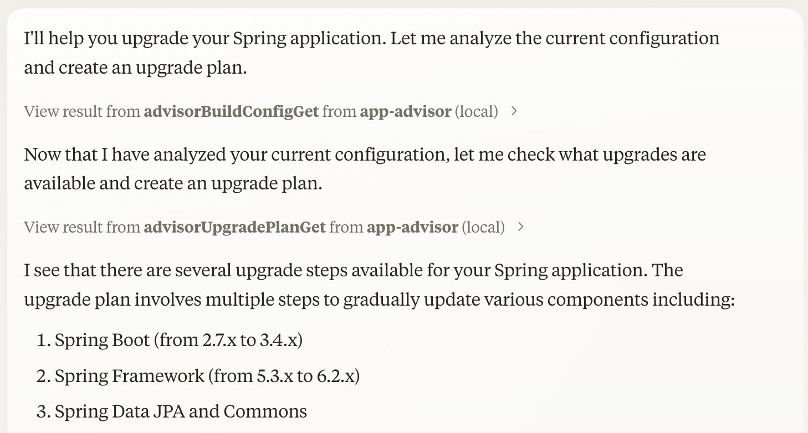

# Cloud Foundry MCP Server

This MCP Server provides an LLM interface for interacting with [Spring Application Advisor](https://techdocs.broadcom.com/us/en/vmware-tanzu/spring/tanzu-spring/commercial/spring-tanzu/app-advisor-what-is-app-advisor.html). It was built with the [Spring AI MCP](https://spring.io/blog/2024/12/11/spring-ai-mcp-announcement) project.



## Building the Server

```bash
./mvnw clean package
```

## Configuration

You will need to supply a configuration for the server for your MCP Client. Here's what the configuration looks like for [claude_desktop_config.json](https://modelcontextprotocol.io/quickstart/user):

```
{
  "mcpServers": {
    "app-advisor": {
      "command": "java",
      "args": [
        "-Dtransport.mode=stdio", "-Dlogging.file.name=/Users/pcorby/Desktop/advisor.webmvc.log", "-jar" ,
        "/Users/pcorby/Projects/OpenAI/app-advisor-mcp/target/app-advisor-mcp-0.0.1-SNAPSHOT.jar",
        "--server.port=8041"
      ],
      "env": {
        "ADVISOR_SERVER": "http://localhost:8080"
      }
  }
}
```
